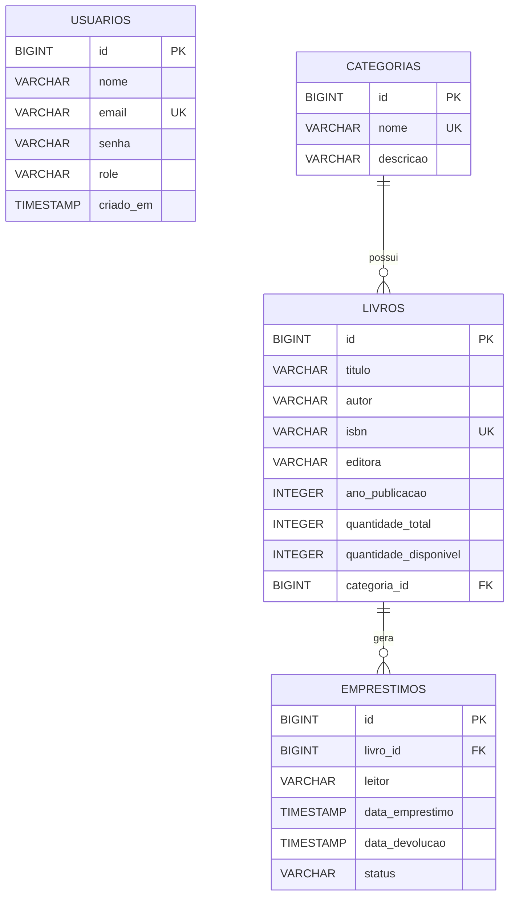

# Diagrama do banco de dados

```mermaid
erDiagram
    USUARIOS {
        BIGINT id PK
        VARCHAR nome
        VARCHAR email UK
        VARCHAR senha
        VARCHAR role
        TIMESTAMP criado_em
    }

    CATEGORIAS {
        BIGINT id PK
        VARCHAR nome UK
        VARCHAR descricao
    }

    LIVROS {
        BIGINT id PK
        VARCHAR titulo
        VARCHAR autor
        VARCHAR isbn UK
        VARCHAR editora
        INTEGER ano_publicacao
        INTEGER quantidade_total
        INTEGER quantidade_disponivel
        BIGINT categoria_id FK
    }

    EMPRESTIMOS {
        BIGINT id PK
        BIGINT livro_id FK
        VARCHAR leitor
        TIMESTAMP data_emprestimo
        TIMESTAMP data_devolucao
        VARCHAR status
    }

    CATEGORIAS ||--o{ LIVROS : possui
    LIVROS ||--o{ EMPRESTIMOS : gera
```

O banco utilizado no projeto e o H2 em arquivo, configurado em `src/main/resources/application.properties`.
